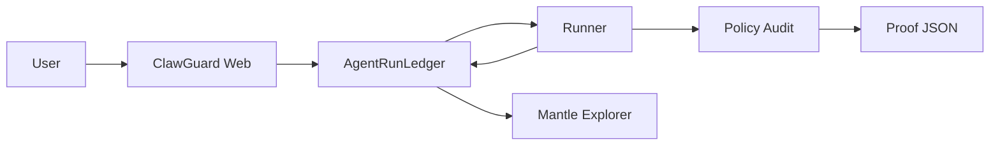

# ClawGuard

ClawGuard is a Mantle Sepolia trust receipt layer for AI wallet agents. It records an agent policy, an instruction hash, a policy audit verdict, and a proof URI so users can inspect what an autonomous wallet agent was allowed to do and where the evidence lives on-chain.

## Public Demo

- Frontend: https://smmyth.github.io/clawguard-ai-wallets-demo/
- Source repo: https://github.com/smmyth/clawguard-ai-wallets
- Deployed static build repo: https://github.com/smmyth/clawguard-ai-wallets-demo
- Demo video: `submission/clawguard-demo.webm`
- Demo video duration: 127.48 seconds

## Mantle Sepolia Deployment

- Chain ID: `5003`
- RPC: `https://rpc.sepolia.mantle.xyz`
- Explorer: `https://explorer.sepolia.mantle.xyz`
- Deployer / burner: `0x691c43F065bbf7bFA692BeE5a2D865f81028Ed3A`
- Faucet tx: https://explorer.sepolia.mantle.xyz/tx/0x4b529efac6b8ff6f39b7fc469ca8994f29834de9b8323cbf144df845b41b8d90

Contracts:

- `AgentRegistry`: `0x12c186925ab7f8ad88a322ee057E4A68e22c88A8`
- Registry explorer: https://explorer.sepolia.mantle.xyz/address/0x12c186925ab7f8ad88a322ee057E4A68e22c88A8
- Registry Sourcify full match: https://repo.sourcify.dev/contracts/full_match/5003/0x12c186925ab7f8ad88a322ee057E4A68e22c88A8/
- `AgentRunLedger`: `0x6b349c752661Fdf085e48053E3186742b3a0D4d2`
- Ledger explorer: https://explorer.sepolia.mantle.xyz/address/0x6b349c752661Fdf085e48053E3186742b3a0D4d2
- Ledger Sourcify full match: https://repo.sourcify.dev/contracts/full_match/5003/0x6b349c752661Fdf085e48053E3186742b3a0D4d2/

Live receipt proof:

- `agentId`: `3`
- `runId`: `4`
- Register tx: https://explorer.sepolia.mantle.xyz/tx/0x36f5dbc6aa5e19119b223a2d5a2bb1890a1ad7204aeeb4d5b2d8902db32c9c30
- Request tx: https://explorer.sepolia.mantle.xyz/tx/0x856a67915f7457e9d822b9338ee6f8ea8d64838a43813d81c100ac68f044e83f
- Request block: `39710840`
- Audit tx: https://explorer.sepolia.mantle.xyz/tx/0x10a4bf4c55f578b254c0b1fd8b0a906cd42937cfd3f6ddd5ec179304af57adbf
- Audit block: `39710846`
- On-chain status: `1` (`Audited`)
- On-chain verdict: `1` (`Allowed`)
- Risk score: `24`
- Proof URI: `/proofs/generated/run-4-allowed.json`
- Proof hash: `0x1d8c356529b185fa064176dedfe393ae007f7d17197067bfddb77d5cdefecfd3`
- Public proof JSON: https://smmyth.github.io/clawguard-ai-wallets-demo/proofs/generated/run-4-allowed.json

Note: both contracts are visible as verified contracts on the Mantle Sepolia explorer, and both also have Sourcify full-match verification for chain `5003`.

## Claim Matrix

Safe today:

- Deployed on Mantle Sepolia chain `5003`.
- Contracts are verified on Mantle Explorer and Sourcify full-match verified.
- A live runner wrote a policy audit verdict on-chain through `recordAuditResult`.
- Public frontend, video, proof JSON, and open-source repo are available.

Safe only after V2 evidence exists:

- Agent action execution is gated by a ClawGuard receipt through `AgentWallet`.
- Agent identity is ERC-8004-aligned through an ERC-721 identity registry.
- The audit proof includes model-backed reasoning rather than deterministic fallback.
- The project uses Byreal Agent Skills, Byreal Perps CLI, or RealClaw core capabilities.

Not claimed:

- Mainnet custody.
- Production Byreal or RealClaw integration before evidence exists.
- RWA functionality.
- Alpha/Data track fit based on Mantle on-chain data as a core source.

## Architecture



## Packages

- `contracts`: Hardhat, `AgentRegistry`, `AgentRunLedger`, tests, deployment and verification scripts.
- `services/runner`: event polling listener, deterministic audit, optional OpenAI rationale, proof writer.
- `web`: React/Vite app with replay mode, wallet mode, policy panel, verdict panel, receipt timeline, and explorer links.
- `submission`: pitch pack, demo script, and generated demo video.
- `docs`: deployment evidence and operational notes.

## Local Setup

```powershell
npm install
npm test
npm run build
```

Run the frontend:

```powershell
npm run dev:web -- --port 5173
```

Run the deterministic runner demo without chain access:

```powershell
npm run demo:runner
```

Run the live runner against Mantle Sepolia:

```powershell
$env:RUNNER_POLLING_MS="5000"
npm run dev -w runner
```

The runner uses `eth_getLogs` polling instead of long-lived JSON-RPC filters because the Mantle public RPC returned `filter not found` for `eth_getFilterChanges` during live testing.

## Environment

Copy `.env.example` to `.env` and set:

- `MANTLE_RPC_URL`
- `PRIVATE_KEY`
- `AGENT_REGISTRY_ADDRESS`
- `AGENT_RUN_LEDGER_ADDRESS`
- optional `OPENAI_API_KEY`

Do not commit `.env`. The repository uses a local burner key only for testnet deployment and demo transactions.

## Submission Claim Rules

Safe claims:

- "ClawGuard demonstrates a trust receipt layer for RealClaw-style AI wallet agents."
- "Contracts are deployed on Mantle Sepolia."
- "Contract source is verified on Mantle Explorer and Sourcify with full match for chain `5003`."
- "A live `RunRequested` event was audited by the runner and recorded through `RunAudited`."
- "The public frontend links to the Mantle receipt and proof JSON."

Do not claim:

- A production Byreal/RealClaw integration.
- Custody of user funds.
- Mainnet deployment.
- OpenAI-generated rationale unless `OPENAI_API_KEY` is actually configured and exercised.

## Dependency Audit Note

`npm audit --omit=dev --omit=optional` reports two moderate findings from `ethers@6.16.0` pinning `ws@8.17.1`. The npm-recommended fix downgrades to `ethers@5.8.0`, which would break the v6 BrowserProvider and contract-client code. Keep this as a known dependency risk unless the project migrates to a patched ethers release or a different client library.
