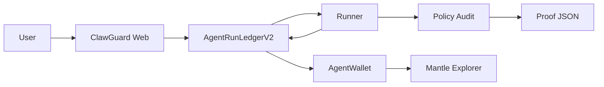

# ClawGuard

ClawGuard is a Mantle Sepolia trust receipt layer for AI wallet agents. It records an agent policy, an instruction hash, a policy audit verdict, and a proof URI, then uses a finalized receipt to gate the `AgentWallet.executeAction` testnet transfer path.

## Public Demo

- Frontend: https://smmyth.github.io/clawguard-ai-wallets-demo/
- Source repo: https://github.com/smmyth/clawguard-ai-wallets
- Deployed static build repo: https://github.com/smmyth/clawguard-ai-wallets-demo
- Demo video: `submission/clawguard-demo.webm`
- Demo video duration: 127.48 seconds

## Mantle Sepolia Deployment

- Chain ID: `5003`
- RPC: `https://rpc.sepolia.mantle.xyz`
- Explorer: `https://explorer.sepolia.mantle.xyz`
- Deployer / burner: `0x691c43F065bbf7bFA692BeE5a2D865f81028Ed3A`
- Faucet tx: https://explorer.sepolia.mantle.xyz/tx/0x4b529efac6b8ff6f39b7fc469ca8994f29834de9b8323cbf144df845b41b8d90

Current V2 contracts:

- `AgentRegistry`: `0x6245caE82a9Cb257Ae3c7a70D633c1b35E071464`
- Registry explorer: https://explorer.sepolia.mantle.xyz/address/0x6245caE82a9Cb257Ae3c7a70D633c1b35E071464
- Registry Sourcify full match: https://repo.sourcify.dev/contracts/full_match/5003/0x6245caE82a9Cb257Ae3c7a70D633c1b35E071464/
- `AgentRunLedgerV2`: `0x572875Be3DDf633169Ff5A5162eB435ba4113e64`
- Ledger explorer: https://explorer.sepolia.mantle.xyz/address/0x572875Be3DDf633169Ff5A5162eB435ba4113e64
- Ledger Sourcify full match: https://repo.sourcify.dev/contracts/full_match/5003/0x572875Be3DDf633169Ff5A5162eB435ba4113e64/
- `AgentWallet`: `0xe29f4883FaFc657CD21F09fCc6BbF41876Eb97d0`
- Wallet explorer: https://explorer.sepolia.mantle.xyz/address/0xe29f4883FaFc657CD21F09fCc6BbF41876Eb97d0
- Wallet Sourcify full match: https://repo.sourcify.dev/contracts/full_match/5003/0xe29f4883FaFc657CD21F09fCc6BbF41876Eb97d0/

Live V2 gated execution proof:

- `agentId`: `1`
- `runId`: `1`
- AgentWallet funding tx: https://explorer.sepolia.mantle.xyz/tx/0xd5e17f814d1edeb54c5965073e3746361bc856a5ed90664f7a76917bb5025713
- Request tx: https://explorer.sepolia.mantle.xyz/tx/0x3630f0fa2a537ebb5ccb6b588af9daa5edcfceb9f579d4f1299192f8e8c295c8
- Audit tx: https://explorer.sepolia.mantle.xyz/tx/0x93535d135b081c584c4d3d63341c7fc0a873745daa5ed3f2441d375d603fbfce
- Finalize tx: https://explorer.sepolia.mantle.xyz/tx/0x6210b44d229110db8f1cc7067778b18647799c48deb9f1b06a828c4b92889cb9
- Execute tx: https://explorer.sepolia.mantle.xyz/tx/0x3b8bfda7ab32cae841bba4718f8af214ce6e6bb6a83b11bf6a8132fe19b76ff5
- On-chain status: `2` (`Finalized`)
- On-chain verdict: `1` (`Allowed`)
- Risk score: `24`
- Action hash: `0x9adf4e5e334b02df1f1958dbf012aed611d3f39e5841d2fd10907550dfb69e61`
- Audit proof URI: `/proofs/generated/run-1-allowed-v2.json`
- Audit proof hash: `0x8ef4c30ba89b0971233615dbc6188171f4e905eb7a99aff425c6eeb4704604a7`
- Final proof URI: `/proofs/generated/run-1-allowed-v2-final.json`
- Final proof hash: `0x1e785ac40c8eb575fdba871ec7602c8ef983a643ef72b644a1aa2e3c3883212b`
- Public final proof JSON: https://smmyth.github.io/clawguard-ai-wallets-demo/proofs/generated/run-1-allowed-v2-final.json

Verification note: the three V2 contracts are Sourcify full-match verified for chain `5003`. The Mantle explorer address pages are publicly accessible, but the Etherscan-style verification API returned HTML instead of JSON during Hardhat verification, so this README does not claim successful Etherscan-style API verification for V2.

## Claim Matrix

Safe today:

- Deployed on Mantle Sepolia chain `5003`.
- V2 contracts are Sourcify full-match verified.
- A live runner wrote a policy audit verdict on-chain through `recordAuditResult`.
- A finalized ClawGuard receipt gated a live AgentWallet testnet transfer through `executeAction`.
- Public frontend, video, proof JSON, and open-source repo are available.
- `AgentWallet` keeps an owner-only `sweep` recovery path for leftover testnet balance; the claim is that the agent action path is receipt-gated.
- `npm run verify-proof` provides a reproducible DevTool gate for allowed/warn/blocked cases and validates the public final proof action hash.

Safe only after additional evidence exists:

- Agent identity is ERC-8004-aligned through an ERC-721 identity registry.
- A future audit proof includes model-backed reasoning rather than deterministic fallback; the current V2 public proof is deterministic fallback with `model: null`.
- The project uses Byreal Agent Skills, Byreal Perps CLI, or RealClaw core capabilities.

Not claimed:

- Mainnet custody.
- Production Byreal or RealClaw integration before evidence exists.
- RWA functionality.
- Alpha/Data track fit based on Mantle on-chain data as a core source.

## Architecture



## Packages

- `contracts`: Hardhat, `AgentRegistry`, `AgentRunLedger`, `AgentWallet`, tests, deployment and verification scripts.
- `services/runner`: event polling listener, deterministic audit, optional OpenAI rationale, action planner, proof writer, proof verifier.
- `web`: React/Vite app with live receipt replay, new wallet request mode, policy panel, verdict panel, audit trace, receipt timeline, AgentWallet panel, and explorer links.
- `submission`: pitch pack, demo script, and generated demo video.
- `docs`: deployment evidence and operational notes.

## DevTool Workflow

ClawGuard is not only a demo screen. Builders can run the audit gate against fixed cases and the published proof:

```powershell
npm run verify-proof
```

This command checks:

- an allowed low-risk wallet action;
- a warning case for high-slippage wallet behavior;
- a blocked command-execution request;
- the public final proof schema;
- the final `actionHash` against the committed recipient and amount.

See `docs/devtool_workflow.md` for the integration path for another agent runner.

## Model-Backed Proof Upgrade

The public V2 receipt is intentionally honest: deterministic guardrail audit, no model-backed rationale. To create a new public model-backed receipt, set a real `OPENAI_API_KEY` and run:

```powershell
npm run prize:model-run
```

The command refuses to publish if the OpenAI call falls back. On success it creates a new `requestRun`, writes an `openai-responses` proof JSON, records that proof hash through `recordAuditResult`, finalizes the action commitment, and prints the new transaction hashes and proof paths. Update the public frontend proof path only after that output exists.

## PMF And GTM

Initial users:

- wallet-agent teams that need inspectable policy receipts before letting agents move funds;
- Mantle hackathon and testnet projects that need a simple trust layer for agent demos;
- agent marketplaces that need portable receipts for policy, tool inventory, verdicts, and outcomes;
- wallet safety dashboards that want a public proof URL rather than a private backend log.

Post-hackathon wedge:

- free public receipt viewer for community trust and demos;
- SDK/API for agent runners to emit receipts;
- paid monitoring for persistent policy baselines, alerting, and proof retention;
- marketplace badge for agents with recent passing ClawGuard receipts.

## Local Setup

```powershell
npm install
npm test
npm run build
```

Run the frontend:

```powershell
npm run dev:web -- --port 5173
```

Run the deterministic runner demo without chain access:

```powershell
npm run demo:runner
```

Run the DevTool verifier:

```powershell
npm run verify-proof
```

Run the live runner against Mantle Sepolia:

```powershell
$env:RUNNER_POLLING_MS="5000"
npm run dev -w runner
```

The runner uses `eth_getLogs` polling instead of long-lived JSON-RPC filters because the Mantle public RPC returned `filter not found` for `eth_getFilterChanges` during live testing.

## Environment

Copy `.env.example` to `.env` and set:

- `MANTLE_RPC_URL`
- `PRIVATE_KEY`
- `AGENT_REGISTRY_ADDRESS`
- `AGENT_RUN_LEDGER_ADDRESS`
- optional `AGENT_WALLET_ADDRESS`
- optional `RUNNER_FINALIZE_ACTION=true`
- optional `RUNNER_INSTRUCTION`
- optional `AGENT_ACTION_RECIPIENT`
- optional `AGENT_ACTION_AMOUNT_WEI`
- optional `MANTLE_EXPLORER_API_KEY`
- optional `MANTLE_EXPLORER_API_URL`
- optional `VITE_AGENT_WALLET_ADDRESS`
- optional `VITE_AGENT_ACTION_HASH`
- optional `VITE_AGENT_EXECUTION_TX`
- optional `VITE_BASE_PATH`
- optional `VITE_ASSETS_DIR`
- optional `OPENAI_API_KEY`

Do not commit `.env`. The repository uses a local burner key only for testnet deployment and demo transactions.

## Submission Claim Rules

Safe claims:

- "ClawGuard demonstrates a trust receipt layer for RealClaw-style AI wallet agents."
- "Contracts are deployed on Mantle Sepolia."
- "V2 contract source is Sourcify full-match verified for chain `5003`."
- "A live `RunRequested` event was audited by the runner, finalized, and executed through AgentWallet."
- "The public frontend links to the Mantle receipt and proof JSON."
- "The repo includes a reproducible DevTool verifier for allowed/warn/blocked policy behavior."

Do not claim:

- A production Byreal/RealClaw integration.
- Custody of user funds.
- Mainnet deployment.
- OpenAI-generated rationale unless `OPENAI_API_KEY` is actually configured and exercised.

## Dependency Audit Note

`npm audit --omit=dev --omit=optional` reports two moderate findings from `ethers@6.16.0` pinning `ws@8.17.1`. The npm-recommended fix downgrades to `ethers@5.8.0`, which would break the v6 BrowserProvider and contract-client code. Keep this as a known dependency risk unless the project migrates to a patched ethers release or a different client library.
